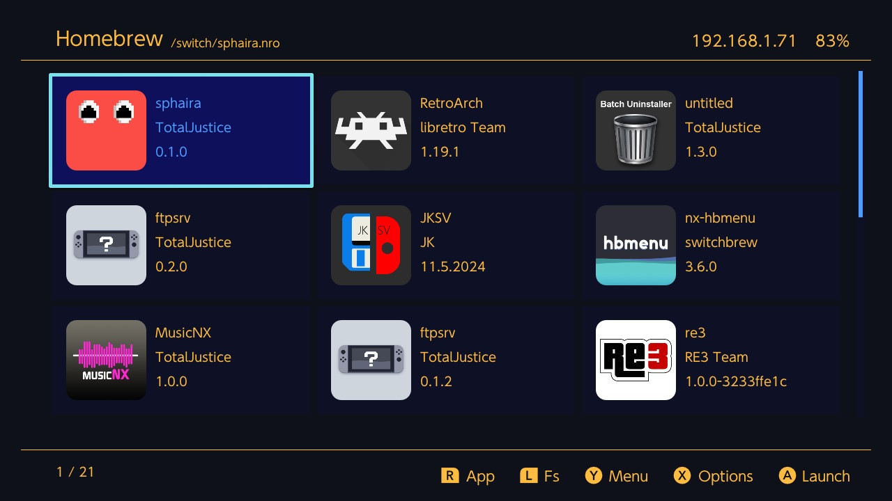
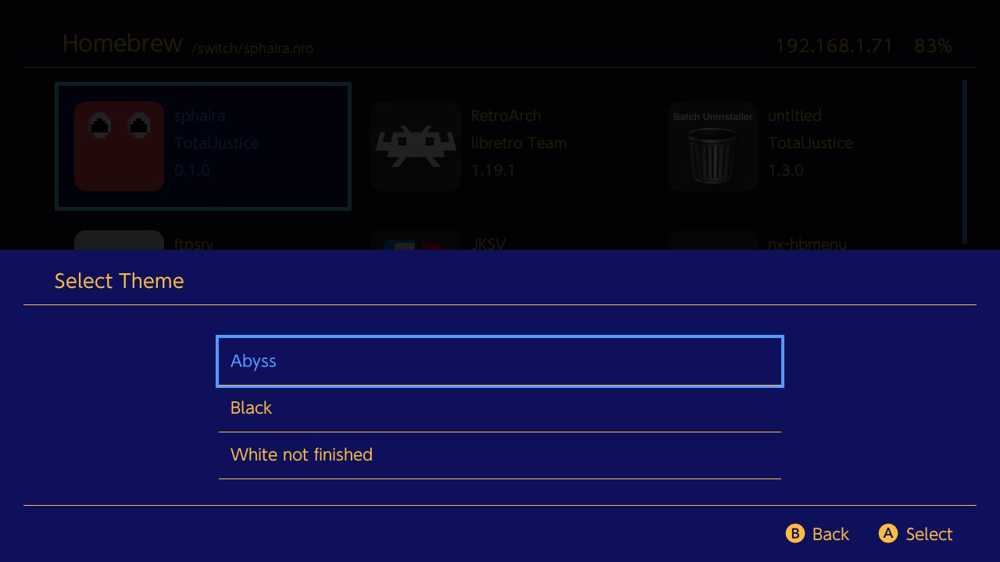
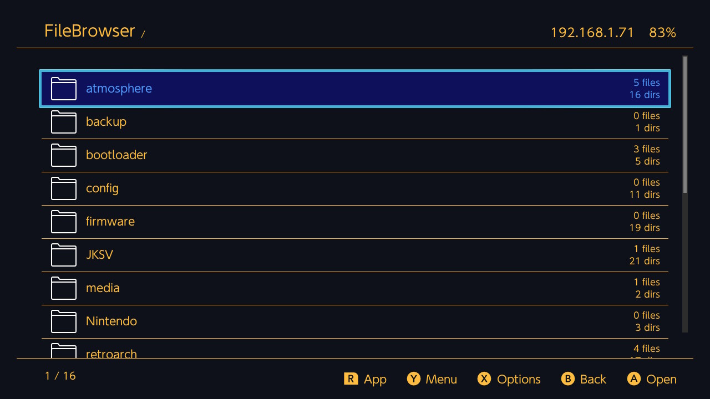
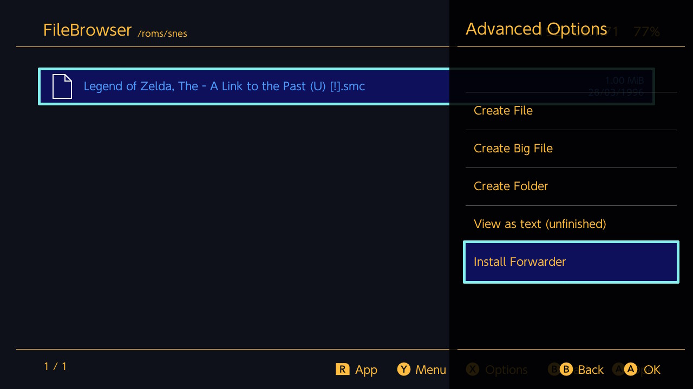
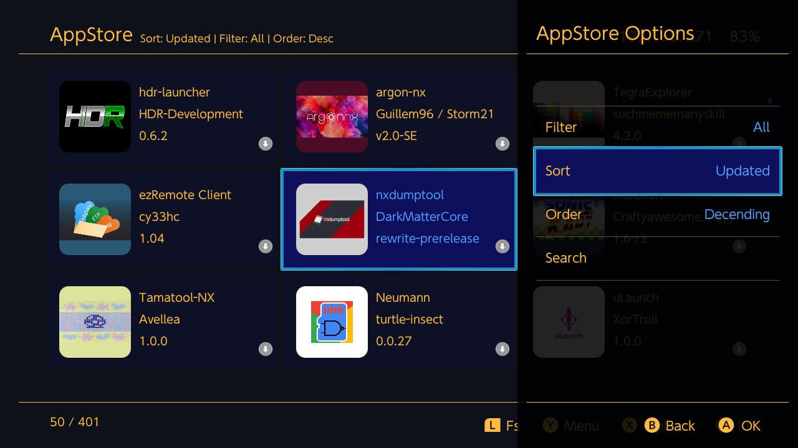
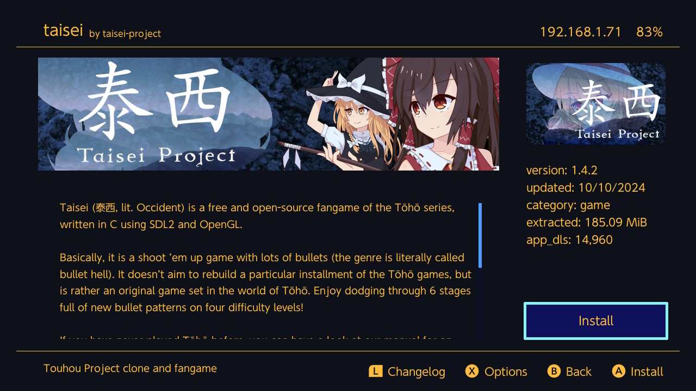
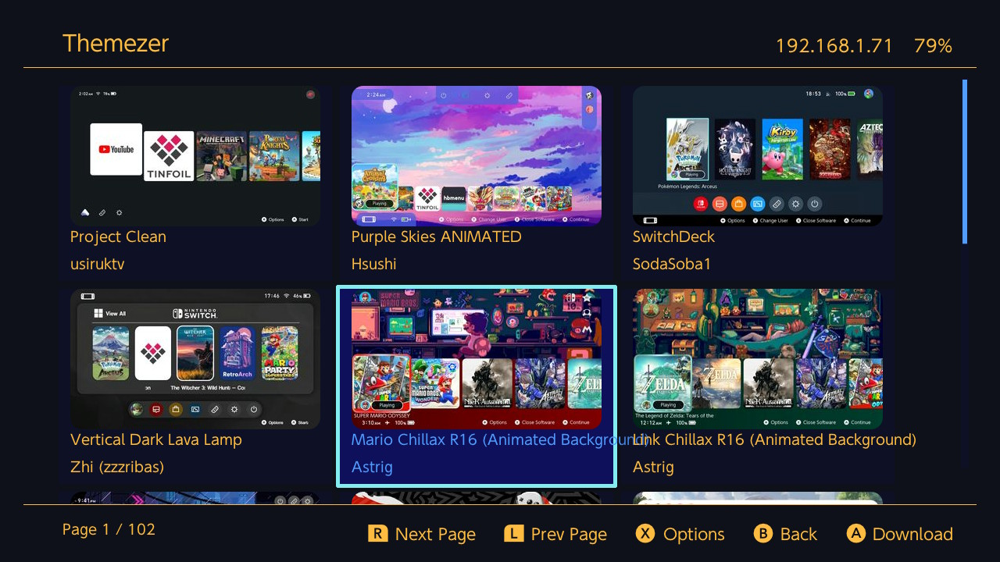
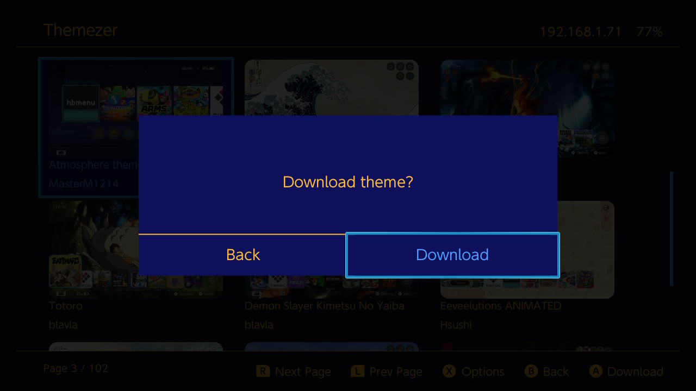

# Sphaira

A homebrew menu for the Nintendo Switch.

[See the GBATemp thread for more details / discussion](https://gbatemp.net/threads/sphaira-hbmenu-replacement.664523/).

[We have now have a Discord server!](https://discord.gg/8vZBsrprEc). Please use the issues tab to report bugs, as it is much easier for me to track.

## Showcase

|                          |                          |
:-------------------------:|:-------------------------:
 | 
 | 
 | 
 | 

## Bug reports

For any bug reports, please use the issues tab and explain in as much detail as possible!

Please include:

- CFW type (i assume Atmosphere, but someone out there is still using Rajnx);
- CFW version;
- FW version;
- The bug itself and how to reproduce it.

## FTP

FTP can be enabled via the network menu. It uses the same config as ftpsrv `/config/ftpsrv/config.ini`. [See here for the full list
of all configs available](https://github.com/ITotalJustice/ftpsrv/blob/master/assets/config.ini.template).

## MTP

MTP can be enabled via the Network menu.

## File association

Sphaira has file association support. Let's say your app supports loading .png files, then you could write an association file, then when using the file browser, clicking on a .png file will launch your app along with the .png file as argv[1]. This was primarly added for rom loading support for emulators / frontends such as RetroArch, MelonDS, mGBA etc.

```ini
[config]
path=/switch/your_app.nro
supported_extensions=jpg|png|mp4|mp3
```

The `path` field is optional. If left out, it will use the name of the ini to find the nro. For example, if the ini is called mgba.ini, it will try to find the nro in /switch/mgba.nro and /switch/folder/mgba.nro.

See `assets/romfs/assoc/` for more examples of file assoc entries.

## Installing (applications)

Sphaira can install applications (nsp, xci, nsz, xcz) from various sources (sd card, gamecard, ftp, usb).

For informantion about the install options, [see the wiki](https://github.com/ITotalJustice/sphaira/wiki/Install).

### Usb (install)

The USB protocol is the same as tinfoil, so tools such as [ns-usbloader](https://github.com/developersu/ns-usbloader) and [fluffy](https://github.com/fourminute/Fluffy) should work with sphaira. You may also use the provided python script found [here](tools/usb_install_pc.py).

### Ftp (install)

Once you have connected your ftp client to your switch, you can upload files to install into the `install` folder.

## Building from source

You will first need to install [devkitPro](https://devkitpro.org/wiki/Getting_Started).

Next you will need to install the dependencies:
```sh
sudo pacman -S switch-dev deko3d switch-cmake switch-curl switch-glm switch-zlib
```

Once devkitPro and all dependencies are installed, you can now build sphaira.

```sh
git clone https://github.com/ITotalJustice/sphaira.git
cd sphaira
cmake --preset MinSizeRel
cmake --build --preset MinSizeRel
```

The output will be found in `build/MinSizeRel/sphaira.nro`

## Credits

- borealis
- stb
- yyjson
- nx-hbmenu
- nx-hbloader
- deko3d-nanovg
- libpulsar
- minIni
- GBATemp
- hb-appstore
- haze
- Everyone who has contributed to this project!
